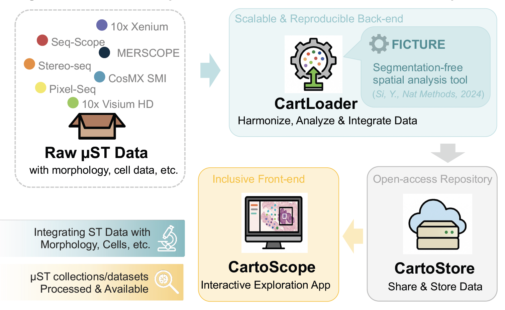

# CartLoader

## A Scalable, Harmonized, and Cloud-friendly Ecosystem

Spatial transcriptomics (ST) technologies have revolutionized our ability to map molecular features with remarkable resolution—down to cellular and subcellular levels. The rapid development of sequencing-based platforms (e.g., [Seq-Scope](https://www.nature.com/articles/s41596-024-01065-0), [Stereo-seq](https://www.bgi.com/global/service/spatial-transcriptome-stereo-seq), [Pixel-seq](https://www.cell.com/cell/fulltext/S0092-8674(22)01367-8), [10x Visium HD](https://www.10xgenomics.com/platforms/visium)) and imaging-based platforms (e.g., [10x Xenium](https://www.10xgenomics.com/platforms/xenium), [Vizgen MERSCOPE](https://vizgen.com/merscope-ultra/), [CosMx SMI](https://nanostring.com/products/cosmx-spatial-molecular-imager)) has led to an explosion in the production of ST datasets across diverse tissues and species.

However, the rapid diversification of spatial transcriptomics platforms has led to heterogeneous data formats, inconsistent metadata schemas, and platform-specific analysis pipelines. Moreover, existing tools often lack the scalability to visualize gigapixel-scale data without downsampling.

To address this challenge, we introduce a scalable, harmonized, and cloud-friendly CartoScope ecosystem for spatial omics data across platforms.

## Ecosystem Overview

The CartoScope ecosystem is structures as illustrated below:

Together, they provide a unified solution for working with raw pixel-level spatial omics data — whether from our repository or your own lab — without sacrificing resolution or reproducibility.

## Core Module Details

=== "[**`CartLoader`**](https://seqscope.github.io/cartloader)"

    **CartLoader** is the backend pipeline that prepares data for CartoScope. It provides a modular, reproducible tool to harmonize, integrate, analyze, and visualize raw high-resolution ST data across platforms. 

    !!! abstract "Table of Contents"
        The current document includes:

        - [**Quick Start**](./vignettes/quickstart/intro.md) section for getting started with `cartloader`.
        - [**Installation**](./installation.md) section for installation.
        - [**Vignettes**](./vignettes/intro.md) section for usage examples.
        - [**Reference**](./reference/intro.md) section for detailed descriptions (action, inputs, outputs, and parameters).

    !!! info "Key Features"

        - **Cross-Platform Format Conversion**: Converts raw SGE data from diverse ST platforms (public or your own) into a unified format, enabling consistent downstream processing.
        - **Spatial Factor Inference**: Applies [FICTURE](https://www.nature.com/articles/s41592-024-02415-2) to infer spatial factors directly from pixel-level data, capturing biological patterns without requiring cell segmentation.
        - **Multi-Modal Alignment**: Aligns and overlays histology images with SGE data so all layers share a common coordinate system for pixel-accurate comparisons.
        - **Cloud-Friendly Outputs**: Produces compact, geospatially-indexed data formats suitable for web visualization and cloud storage.
        - **Batch Integration and Sample Stitching**: Supports joint analysis and SGE stitching across samples or platforms to reveal shared or differential features across tissues.
        - **Modular and Reproducible Workflow**: Orchestrates all steps through a Makefile-based system to ensure scalability, transparency, and reproducibility.

    

=== "[**`CartoStore`**](https://github.com/seqscope/cartostore)" 
   
    **CartoStore** acts as the data repository, hosting datasets processed by CartLoader and making them accessible to CartoScope. Visit the [CartoStore Repository](https://github.com/seqscope/cartostore) to access public datasets.

    !!! info "Key Features"

        - **Ready-to-use Datasets**: Access processed, high-resolution datasets featuring FICTURE analysis results, morphology images, and cell analysis results, ready for immediate interactive exploration.
        - **Broad Coverage**: Spans diverse species, tissues, and disease models for a wide range of research needs.
        - **Growing Repository**: Continuously updated with new datasets as they are processed and added.

=== "[**`CartoScope`**](index.md)"

    **CartoScope** is the frontend web-based App of our ecosystem, which enables interactive, pixel-level exploration of spatial omics data without requiring programming expertise. Visit the [CartoScope Documentation](https://seqscope.github.io/cartoscope3o/) for more details
        
    !!! tips "Flexible Data Exploration"
        - **Explore Public Atlas**: Access our ready-to-use collection of high-resolution spatial datasets.
        - **Bring Your Own Data**: Load, visualize, and interactively analyze your own custom datasets using our system.

    !!! info "Key Features"

        - **Ultra-high-resolution data at scale**: Seamless web exploration for submicron-resolution ST data with hundreds of millions of spatial pixels, tens of thousands of genes, and billions of transcripts.
        - **Molecular-level Inference with FICTURE**: Powered by the latest version of [FICTURE](https://www.nature.com/articles/s41592-024-02415-2) analysis, it helps interpret the spatial factors while preserving spatial accuracy and complexity. This method breaks the barrier of histology-based segmentation bias.
        - **Dynamic Multi-layer Exploration**: Interactive multi-layer maps with aligned multimodal datasets—including morphology images, cell-level analysis, molecular inference, and spot summaries—enabling exploration with rich, end-to-end spatial context.
        - **Seamless Integration with Morphology Images**: Support for diverse morphology image formats (H&E, DAPI, fluorescence reporters), seamlessly integrated with omics data.
        - **Interactive ROI Analysis**: Interactively define regions of interest, extract spatial features, and run differential expression analysis.
        - **Save & Share Workspace**: One-click save for your workspace (layers, styling, ROIs) and instant sharing with collaborators via unique links.
        - **Scale-Up Your Own Data**: Fully supports custom datasets—upload your own processing results to visualize and analyze your specific samples with the same powerful tools used for public data.
        - **Open Access**: Upload, screen, and share datasets worldwide at no cost.

---

## Citations

If you use CartoScope in your research, please cite:

* CartoScope: [placeholder](placeholder)
* FICTURE: [doi.org/10.1038/s41592-024-02415-2](https://www.nature.com/articles/s41592-024-02415-2)

