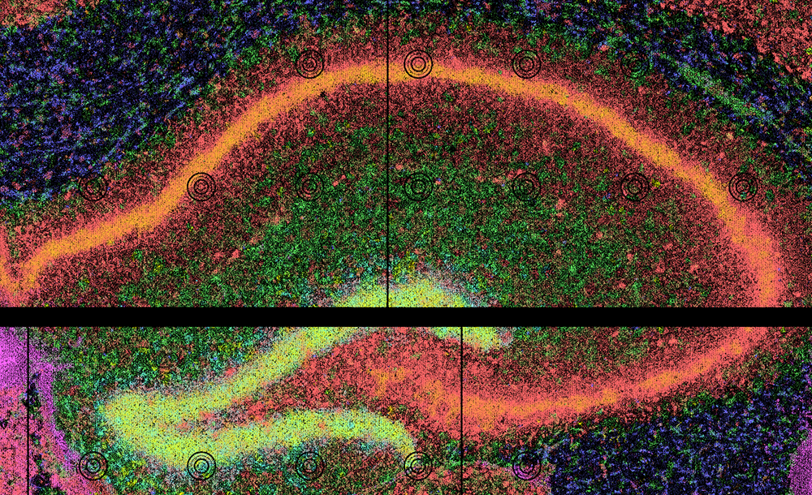
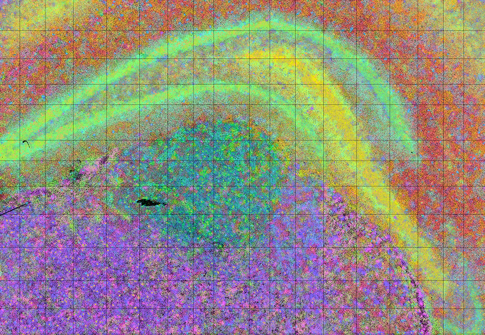
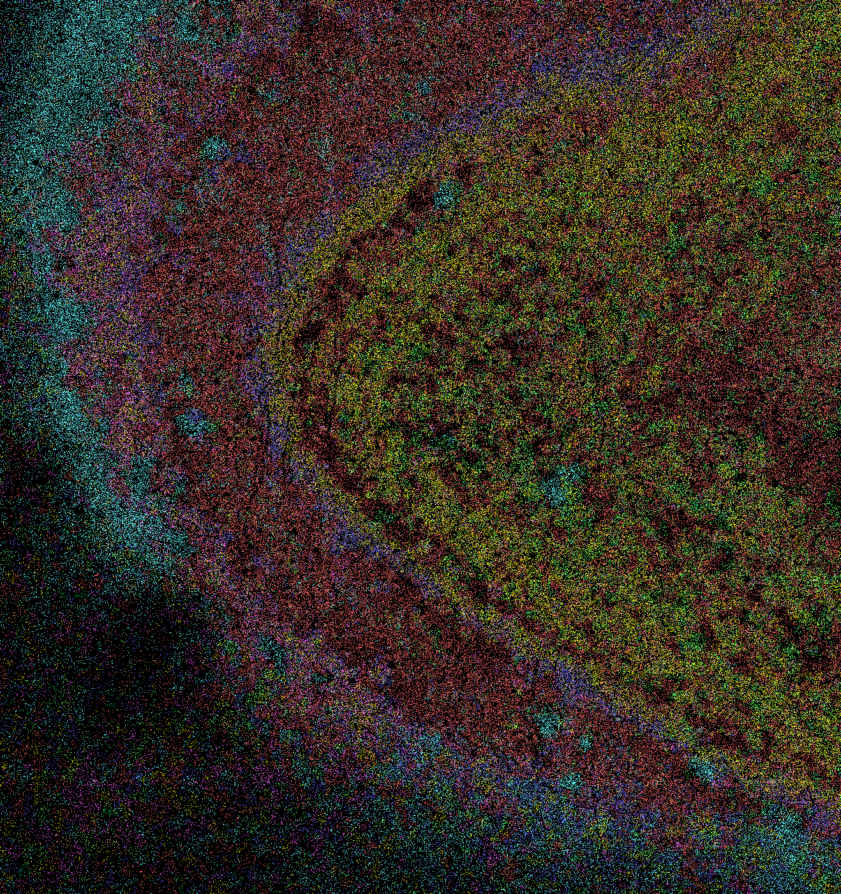
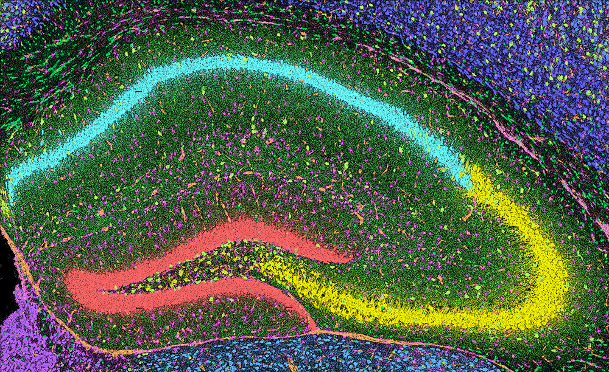
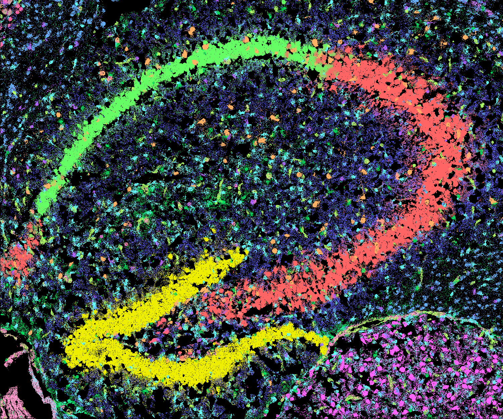
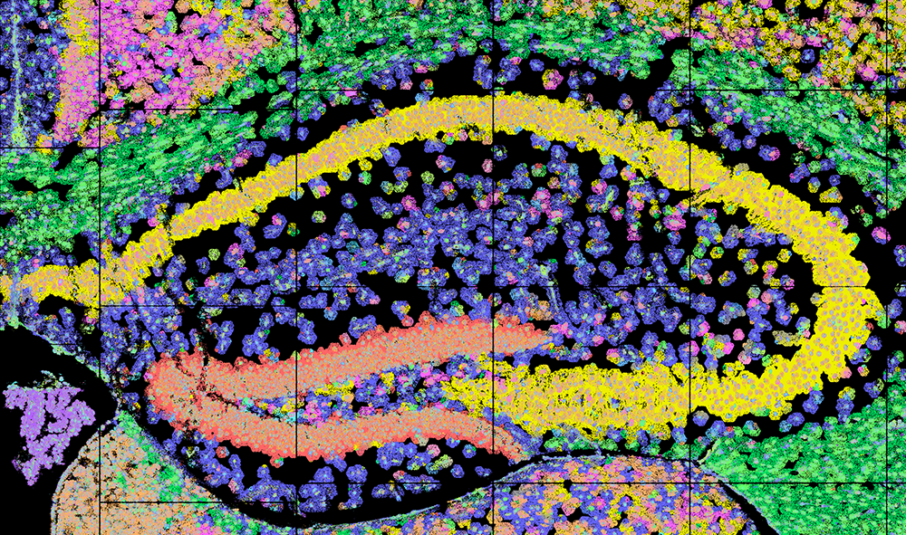

# Vignettes

Explore a series of tutorials that help you learn `CartLoader` — from quick, getting‑started examples to processing full‑scale ST datasets.

To view details of a specific module, see [Reference](../reference/intro.md) section.

## Quick Start

If you’re new to `CartLoader`, start with the [Quick Start](./quickstart/run_locally.md) tutorial, a beginner‑friendly walkthrough using a small mouse hippocampus dataset to core `CartLoader` functions.

-   <figure markdown="span">
    { width="100%" }
    <figcaption class="figure-caption-vigintro-large">Quick Start Tutorial</figcaption>
    </figure>

    [Read](./quickstart/run_locally.md){ .md-button .md-button--primary .button-tight-small }

## Getting Started per Platform

These tutorials demonstrate how to run `CartLoader` on a variety of ST platforms using small, representative datasets.

<!-- If a platform lacks hippocampal data, we select a comparable brain subregion. -->

!!! warning

    For consistency, we use mouse hippocampus when available. 

    Each tutorial begins with data in the platform’s native format.

### Sequencing-based Platforms

-   <figure markdown="span">
    
    <figcaption class="figure-caption-vigintro-large">**SeqScope** Starter Guide</figcaption>
    </figure>

    [Read](./quickstart/run_locally.md){ .md-button .md-button--primary .button-tight-small }

-   <figure markdown="span">
    
    <figcaption class="figure-caption-vigintro-large">**10x Visium HD** Starter Guide</figcaption>
    </figure>

    [Read](./subregion_tutorials/visiumhd.md){ .md-button .md-button--primary .button-tight-small }

-   <figure markdown="span">
    { width="100%", height="300" }
    <figcaption class="figure-caption-vigintro-large">**StereoSeq** Starter Guide</figcaption>
    </figure>

    [Read](./subregion_tutorials/stereoseq.md){ .md-button .md-button--primary .button-tight-small }

-   <figure markdown="span">
    { width="100%" }
    <figcaption class="figure-caption-vigintro-large">**Pixel-seq** Starter Guide</figcaption>
    </figure>

    [Read](./subregion_tutorials/pixelseq.md){ .md-button .md-button--primary .button-tight-small }

### Imaging-based Platforms

-   <figure markdown="span">
    { width="100%" }
    <figcaption class="figure-caption-vigintro-large">**10x Xenium** Starter Guide</figcaption>
    </figure>

    [Read](./subregion_tutorials/xenium.md){ .md-button .md-button--primary .button-tight-small }

-   <figure markdown="span">
    { width="100%" }
    <figcaption class="figure-caption-vigintro-large">**Vizgen MERSCOPE** Starter Guide</figcaption>
    </figure>

    [Read](./subregion_tutorials/merscope.md){ .md-button .md-button--primary .button-tight-small }

-   <figure markdown="span">
    { width="100%" }
    <figcaption class="figure-caption-vigintro-large">**CosMX SMI** Starter Guide</figcaption>
    </figure>

    [Read](./subregion_tutorials/cosmxsmi.md){ .md-button .md-button--primary .button-tight-small }

## End‑to‑end workflows by platform
These examples show how to process real‑world ST datasets from different platform using end-to-end workflow from `CartLoader`.

-   <figure markdown="span">
    { width="100%" }
    <figcaption class="figure-caption-vigintro-large">**10x Xenium** Pipeline Guide</figcaption>
    </figure>

    [Read](./pipelines/xenium.md){ .md-button .md-button--primary .button-tight-small }

-   <figure markdown="span">
    { width="100%" }
    <figcaption class="figure-caption-vigintro-large">**Visium HD** Pipeline Guide</figcaption>
    </figure>

    [Read](./pipelines/visiumhd.md){ .md-button .md-button--primary .button-tight-small }

## Multi‑Sample Analysis

!!! warning
    This section is under active development.

Upcoming content will cover how to process **multiple samples** in a single batch, including cross‑sample analysis.
