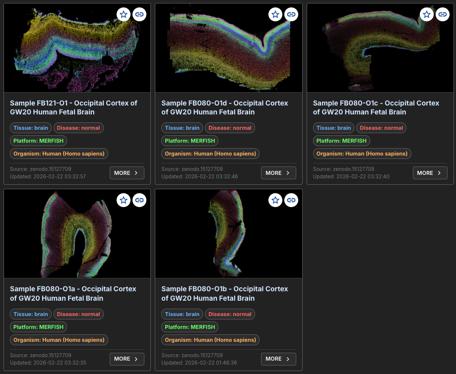

# Human Cortex Multi‑Sample Spatial Factor Analysis Tutorial

This tutorial demonstrates how to run multi‑sample FICTURE analysis and package results. It illustrates from downloading the raw data.


!!! question "Why use Multi‑Sample FICTURE Analysis?"

    **`CartLoader` supports analyzing ≥2 samples in two ways**:

    - Multi‑sample FICTURE analysis ([`run_ficture2_multi`](../reference/run_ficture2_multi.md)): Jointly learns spatial factors across all samples and writes per‑sample outputs in one parallelizable run.
    - SGE stitch + single‑sample analysis ([`sge_stitch`](../reference/sge_stitch.md) → [`run_ficture2`](../reference/run_ficture2.md)): Stitch multiple SGEs into a single mosaic, then train one model on that mosaic.

    **What to expect**

    - Shared factors/comparability: `run_ficture2_multi` learns a cohort‑wide latent basis and returns per‑sample decodes for direct comparison. The stitch approach yields a single model over the merged mosaic; useful when you need a unified coordinate system (e.g., tiling adjacent sections).
    - Efficiency and scale: `run_ficture2_multi` fits once for the cohort and decodes per sample, avoiding repeated runs and post‑hoc alignment. Stitching can be simpler for mosaics but often increases I/O and memory due to very large merged files.

    **Recommendation:**

      - Prefer `run_ficture2_multi` for most cohorts for clean per‑sample outputs and better computational efficiency; use stitching when a single shared coordinate frame is required.
    - If you choose stitching, plan for higher resource usage (RAM, disk, and I/O). Large mosaics can be slow to generate and train on, and may require substantially more memory and temporary storage than per‑sample runs.

---

## Input Data

This tutorial uses a series of five human cortex ST datasets from [Walsh et al. Nature 2025](https://www.nature.com/articles/s41586-025-09010-1), generated by MERFISH.


### Data Access

Follow the commands below to download the source data.

```bash
# Define the work directory
work_dir=/path/to/work/directory
mkdir -p ${work_dir}/raw
cd ${work_dir}/raw

wget https://zenodo.org/records/15127709/files/FB080_O1a.zip?download=1
unzip FB080_O1a.zip

wget https://zenodo.org/records/15127709/files/FB080_O1b.zip?download=1
unzip FB080_O1b.zip

wget https://zenodo.org/records/15127709/files/FB080_O1c.zip?download=1
unzip FB080_O1c.zip

wget https://zenodo.org/records/15127709/files/FB080_O1d.zip?download=1
unzip FB080_O1d.zip

wget https://zenodo.org/records/15127709/files/FB121_O1.zip?download=1
unzip FB121_O1.zip
```

### File Format

!!! info "`detected_transcripts.csv`"

      ```
      ,barcode_id,global_x,global_y,global_z,x,y,fov,gene,transcript_id,cell_id
      36,0,154.75854,8197.335,0.0,1790.1895,303.81055,0,HS3ST1,ENST00000002596,224295401131100634
      53,0,157.40007,8211.97,0.0,1814.648,439.31885,0,HS3ST1,ENST00000002596,-1
      76,0,154.28473,8230.835,0.0,1785.8022,614.0,0,HS3ST1,ENST00000002596,224295401131100700
      ```

      * Column 1: Unique numeric index for each transcript within a field of view (non-consecutive, ascending).
      * `barcode_id`: Zero-based index of the transcript barcode in the codebook; forms a composite key with `fov`.
      * `global_x`: Transcript x coordinates (µm) in the experimental region; may be negative due to alignment.
      * `global_y`: Transcript y coordinates (µm) in the experimental region; may be negative due to alignment.
      * `global_z`: Zero‑based z‑position index.
      * `x`: The x-coordinate of the transcript (µm), within the coordinate space of the field of view.
      * `y`: The y-coordinate of the transcript (µm), within the coordinate space of the field of view.
      * `fov`: Zero-based field of view index; forms a composite key with `barcode_id`.
      * `gene`: Gene name.
      * `transcript_id`: Unique identifier for the transcript.
      * `cell_id`: Unique identifier for cell.

### Define ID and Parameters

```bash
cd $work_dir
# Unique identifier for your collection
COLLECTION_ID="walsh2025-human-cortex-fb080-O1" # change this to reflect your dataset name
PLATFORM="generic"                      # platform information
SCALE=1                                 # coordinate to micrometer scaling factor

# LDA parameters
train_width=24                           # define LDA training hexagon width (comma-separated if multiple widths are applied)
n_factor=96,192                          # define number of factors in LDA training (comma-separated if multiple n-factor values are provided)
```

---

## Example Runs

### Choose Local or Docker Setup

!!! warning "Choose One Mode"
    This tutorial supports two execution modes:

    - local runs (`cartloader` installed on your machine)
    - Docker runs (`docker run weiqiuc/cartloader:...`)

    **Choose one setup mode and complete that setup only.**

    After setup, both modes use the same pipeline commands via a `cartloader_cmd` wrapper.

=== "**Set Up Local Runs**"

    **Set Up Environment**

    

    **Define command wrapper**

    ```bash
    # Local paths
    raw_root="${work_dir}/raw"
    out_root="${work_dir}"

    # Use the same command shape as Docker mode
    cartloader_cmd() {
      cartloader "$@"
    }
    ```

=== "**Set Up Docker Run**"

    **Set Up Environment**

    

    **Define command wrapper**

    ```bash
    # Host work directory is mounted to /data inside the container
    raw_root="/data/raw"
    out_root="/data"

    # Use the same command shape as local mode
    cartloader_cmd() {
      docker run --rm \
        -v "${work_dir}:/data" \
        weiqiuc/cartloader:${docker_tag} \
        "$@"
    }
    ```

!!! warning
    All remaining commands are identical for local and Docker runs because they call `cartloader_cmd`.

---

### SGE Format Conversion

!!! warning
    Convert each sample transcript file to CartLoader SGE format. Commands below process all five samples in a loop.

=== "Recommended: `sge_convert`"

    ```bash
    cd "${work_dir}"
    mkdir -p "${out_root}/sge"

    sample_ids=(FB080_O1a FB080_O1b FB080_O1c FB080_O1d FB121_O1)

    for sample_id in "${sample_ids[@]}"; do
      mkdir -p "${out_root}/sge/${sample_id}"

      cartloader_cmd sge_convert \
        --in-csv "${raw_root}/${sample_id}/detected_transcripts.csv" \
        --platform generic \
        --out-dir "${out_root}/sge/${sample_id}" \
        --csv-delim "," \
        --csv-colname-x global_x \
        --csv-colname-y global_y \
        --csv-colname-feature-name gene \
        --csv-colnames-others cell_id global_z \
        --sge-visual
    done
    ```

=== "Fast path: direct transform (no visualization/filtering)"

    !!! tip
        Raw coordinates are already in micrometers. Use this only if you do **not** need SGE visualization or density/feature-based filtering.

    ```bash
    cd "${work_dir}"
    mkdir -p "${out_root}/sge"

    sample_ids=(FB080_O1a FB080_O1b FB080_O1c FB080_O1d FB121_O1)

    for sample_id in "${sample_ids[@]}"; do
      mkdir -p "${out_root}/sge/${sample_id}"

      (
        echo -e "X\tY\tgene\tcount\tcell_id\tZ"
        cat "${raw_root}/${sample_id}/detected_transcripts.csv" \
          | tail -n +2 \
          | tr ',' '\t' \
          | perl -lane 'print join("\t",$F[2],$F[3],$F[8],1,$F[10],$F[4]);'
      ) | gzip > "${out_root}/sge/${sample_id}/transcripts.unsorted.tsv.gz"
    done
    ```
---
### Prepare Input List

Create `input.tsv` (tab-separated, one sample per line).

```bash
cd "${work_dir}"

sample_ids=(FB080_O1a FB080_O1b FB080_O1c FB080_O1d FB121_O1)

: > "${out_root}/input.tsv"
for sample_id in "${sample_ids[@]}"; do
  printf "%s\t%s/sge/%s/transcripts.unsorted.tsv.gz\n" \
    "${sample_id}" "${out_root}" "${sample_id}" >> "${out_root}/input.tsv"
done

cat "${out_root}/input.tsv"
```

!!! info "Example Input List: `input.tsv`"

    The TSV should be **one sample per line**, have **no header**, and contain two to four columns.

    ```text
    FB080_O1a    /path/to/work_dir/sge/FB080_O1a/transcripts.unsorted.tsv.gz
    FB080_O1b    /path/to/work_dir/sge/FB080_O1b/transcripts.unsorted.tsv.gz
    FB080_O1c    /path/to/work_dir/sge/FB080_O1c/transcripts.unsorted.tsv.gz
    FB080_O1d    /path/to/work_dir/sge/FB080_O1d/transcripts.unsorted.tsv.gz
    FB121_O1     /path/to/work_dir/sge/FB121_O1/transcripts.unsorted.tsv.gz
    ```

    * `1st Column` (required, str): Unique dataset identifier (avoid whitespace; prefer `-` to `_`).
    * `2nd Column` (required, str): Path to the transcript-indexed SGE file in `CartLoader` format, generated from the SGE format conversion step above.
    * `3rd Column` (optional, str): Dataset title. Quote the value when whitespace is involved.
    * `4th Column` (optional, str): Dataset description. Quote the value when whitespace is involved.
---

### Multi-Sample FICTURE Analysis

Train cohort-level LDA models (per width and factor setting), decode each sample, and write per-sample JSON manifests.

Outputs are written under `ficture2/<sample_id>/`. See details in [run_ficture2_multi](../reference/run_ficture2_multi.md).

```bash
cartloader_cmd run_ficture2_multi \
  --in-list "${out_root}/input.tsv" \
  --out-dir "${out_root}/ficture2" \
  --width "${train_width}" \
  --n-factor "${n_factor}" \
  --exclude-feature-regex "^(Blank-.*$)" \
  --redo-merge-units \
  --ficture2 "${punkst}" \
  --spatula "${spatula}" \
  --threads "${n_jobs}" \
  --n-jobs "${n_jobs}"
```

---

### Multi-Sample Asset Packaging

Package per-sample outputs from `ficture2/<sample_id>/` into web-ready PMTiles and catalogs.

Outputs are written under `cartload2/<sample_id>/`. See details in [run_cartload2_multi](../reference/run_cartload2_multi.md).

```bash
cartloader_cmd run_cartload2_multi \
  --in-list "${out_root}/input.tsv" \
  --fic-dir "${out_root}/ficture2" \
  --out-dir "${out_root}/cartload2" \
  --spatula "${spatula}" \
  --tippecanoe "${tippecanoe}" \
  --threads "${n_jobs}" \
  --n-jobs "${n_jobs}"
```

---

### Upload to AWS

Upload generated outputs to AWS S3, either as one collection or one sample at a time. See [upload_aws](../reference/upload_aws.md) for options.

=== "Upload the whole collection"

    ```bash
    AWS_DIR=s3://your-bucket/${COLLECTION_ID} # Recommend using COLLECTION_ID as the directory name.

    cartloader_cmd upload_aws \
      --in-dir "${out_root}/cartload2" \
      --s3-dir "${AWS_DIR}" \
      --in-list "${out_root}/input.tsv"
    ```

=== "Upload a single sample"

    Below uses `FB080_O1a` as an example.

    ```bash
    AWS_DIR=s3://your-bucket/${COLLECTION_ID} # Recommend using COLLECTION_ID as the directory name.

    cartloader_cmd upload_aws \
      --in-dir "${out_root}/cartload2/FB080_O1a" \
      --s3-dir "${AWS_DIR}/fb080-o1a"
    ```

---

## Output Summary

<div class="grid cards generic" markdown>

-   

    ---

    #### View/Explore

    The outputs are available in CartoScope.

    [Explore in CartoScope](https://v3o-main.carto-scope.org/datasets?collections=multi-sample+analysis+of+human+occipital+cortex+%28gw20%29+development){ .md-button .md-button--primary .button-tight-small }

</div>

See output details in the reference pages for [run_ficture2](../reference/run_ficture2.md) and [run_cartload2](../reference/run_cartload2.md).
