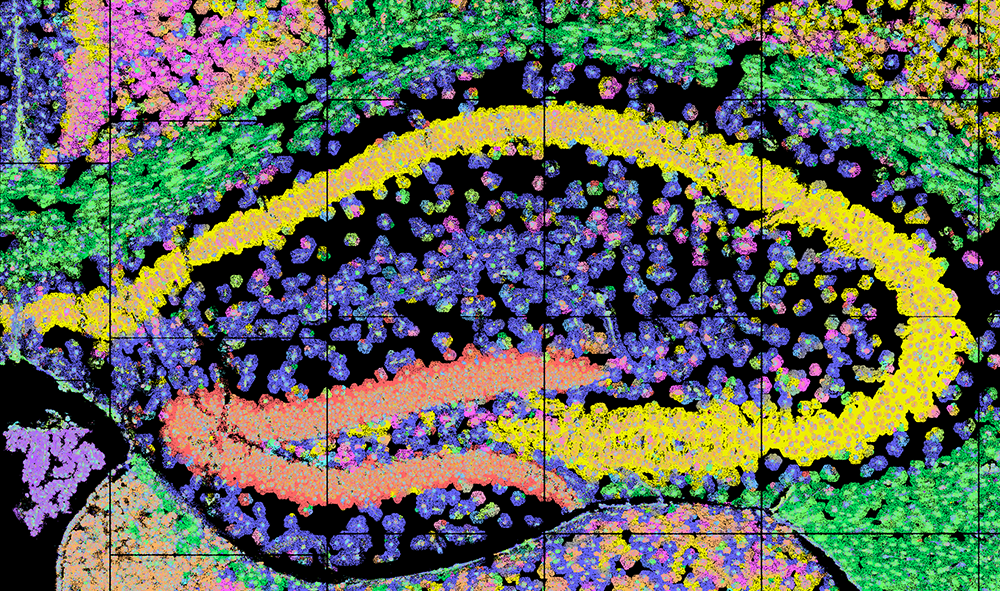

-   

    ---

    #### View/Explore

    The output are available in both CartoScope and Zenodo. 

    [Explore in CartoScope](http://localhost:5173/dataset?uri=s3%2Fcartostore%2Fdata%2Fbatch%3D2025_12%2Fmouse-brain-test-collection%2Fsubdata_cosmxsmi_halfrun1000s1){ .md-button .md-button--primary .button-tight-small }

    [Download from Zenodo](https://zenodo.org/records/17955214){ .md-button .button-tight-small }

See more details of output at the Reference pages for [run_ficture2](../docs/reference/run_ficture2.md) and [run_cartload2](../docs/reference/run_cartload2.md).

