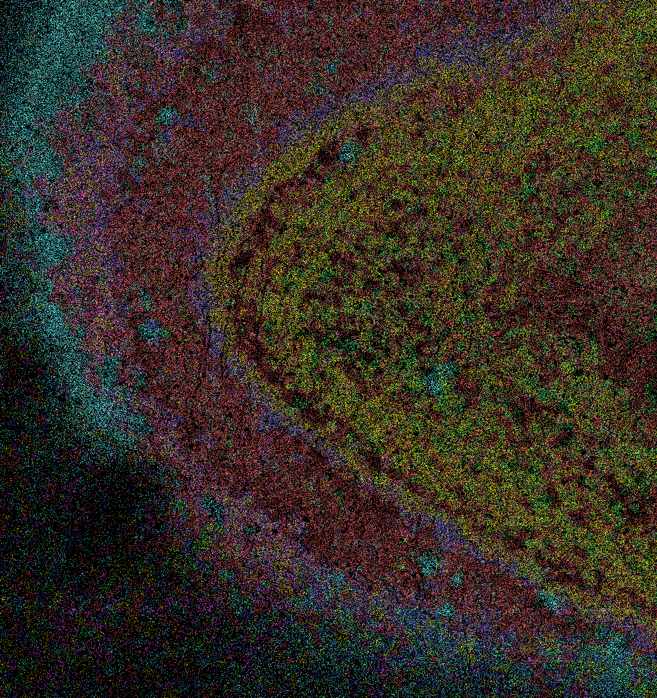

-   

    ---

    #### View/Explore

    The outputs are available in both CartoScope and Zenodo. 

    [Explore in CartoScope](https://v3o-main.carto-scope.org/dataset?uri=s3%2Fcartostore%2Fdata%2Fbatch%3D2026_02%2Fmouse-brain-test-collection%2Fsubdata_pixelseq_gsm5631822){ .md-button .md-button--primary .button-tight-small }

    [Download from Zenodo](https://zenodo.org/records/18837718){ .md-button .button-tight-small }

See output details in the reference pages for [run_ficture2](../docs/reference/run_ficture2.md) and [run_cartload2](../docs/reference/run_cartload2.md).
