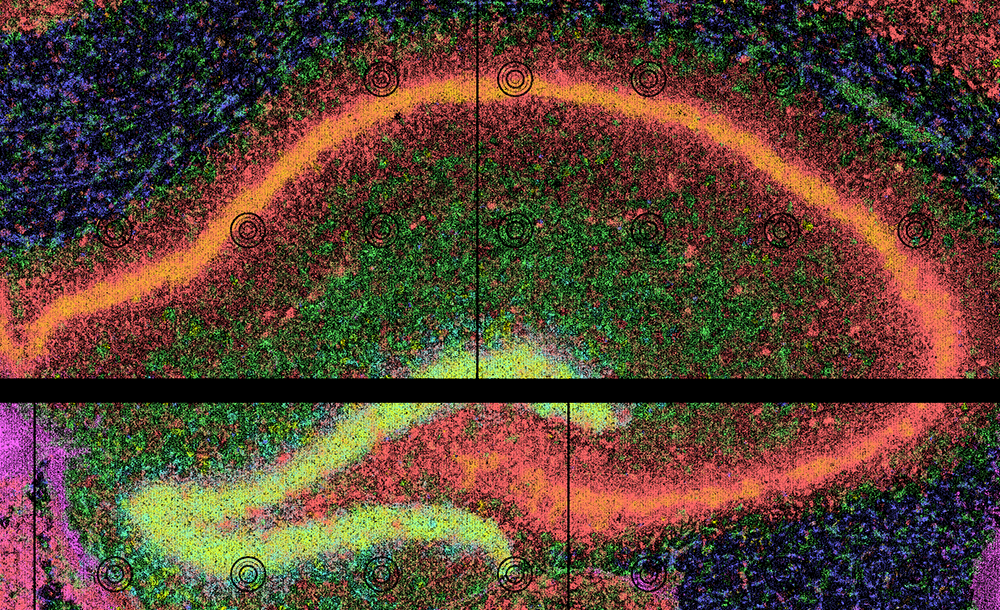

See more details of output at the Reference pages for [run_ficture2](../docs/reference/run_ficture2.md) and [run_cartload2](../docs/reference/run_cartload2.md).

### Spatial Factor Inference
Below is an example of spatial factor inference results from `FICTURE` using a training width of 18, 12 factors, a fit width of 18, and an anchor resolution of 6.

<!-- 

 -->

{{ read_csv('../../tabs/seqscope_starter.t18-f12-p18-a6-info.tsv',sep = '\t') }}

### Packed SGE and Spatial Factor Outputs from `run_cartload2`

The packed SGE data and spatial factor inferences generated by `FICTURE` are available in PMTile format on Zenodo: [DOI:10.5281/zenodo.15759403](https://zenodo.org/records/15759403).

These datasets can also be loaded directly using the following catalog YAML file:  
`https://zenodo.org/records/15802634/catalog.yaml`